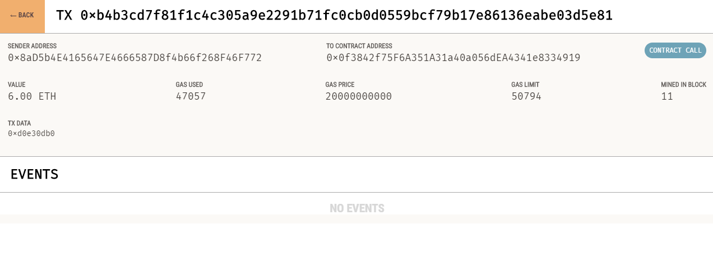

# Unit 20 - "Looks like we've made our first contract!"

## Background

Your new startup has created its own Ethereum-compatible blockchain to help connect financial institutions, and the team wants to build smart contracts to automate some company finances to make everyone's lives easier, increase transparency, and to make accounting and auditing practically automatic.

Fortunately, you've been learning how to program smart contracts with Solidity! What you will be doing this assignment is creating 3 `ProfitSplitter` contracts. These contracts will do several things:

* Pay your associate-level employees quickly and easily.

* Distribute profits to different tiers of employees.

* Distribute company shares for employees in a "deferred equity incentive plan" automatically.

## Files

* [`associate-profit-splitter.sol`](associate-profit-splitter.sol) — Level 1 starter code.

* [`tiered-profit-splitter.sol`](tiered-profit-splitter.sol) — Level 2 starter code.

* [`deffered-equity-plan.sol`](deffered-equity-plan.sol) — Level 3 starter code.

## Instructions

This assignment has three levels of difficulty, with each contract increasing in complexity and capability. Although it is highly recommended you complete all three contracts, you are only required to solve one of the three contracts. We recommend you start with Level 1, then move forward as you complete the challenges. You can build all three with the skills you already have!

* **Level One** is an `associate-profit-splitter` contract. This will accept ether into the contract, and divide it evenly among associate-level employees. This will allow the human resources department to pay employees quickly and efficiently.

* **Level Two** is a `tiered-profit-splitter` that will distribute different percentages of incoming ether to employees at different tiers/levels. For example, the CEO gets paid 60%, CTO 25%, and Bob gets 15%.

* **Level Three** is a `deffered-equity-plan` that models traditional company stock plans. This contract will automatically manage 1000 shares, with an annual distribution of 250 shares over four years for a single employee.

### Starting your project

Navigate to the [Remix IDE](https://remix.ethereum.org) and create a new contract called `AssociateProfitSplitter.sol` using the starter code for Level One above.

While developing and testing your contract, use the [Ganache](https://www.trufflesuite.com/ganache) development chain, and point MetaMask to `localhost:8545`, or replace the port with what you have set in your workspace.

### Setup Ganache 

### Level One: The `AssociateProfitSplitter` Contract

This contracts divides the ether evenly among the associated contracts. 

Deploy the contract using Solidity

Split the deposit of 6 to the associate employees.

Check the status of the transaction 

Confirm the balance of the transaction via Ganache and make sure you have the right addresses

### Level Two: The `TieredProfitSplitter` Contract

### Level Three: The `DeferredEquityPlan` Contract

